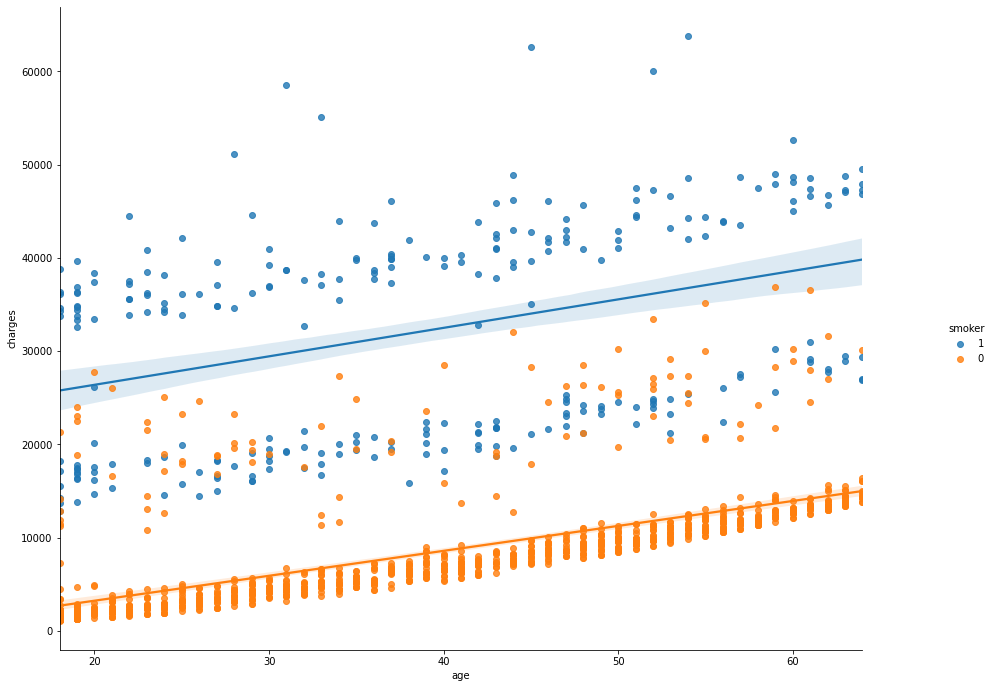
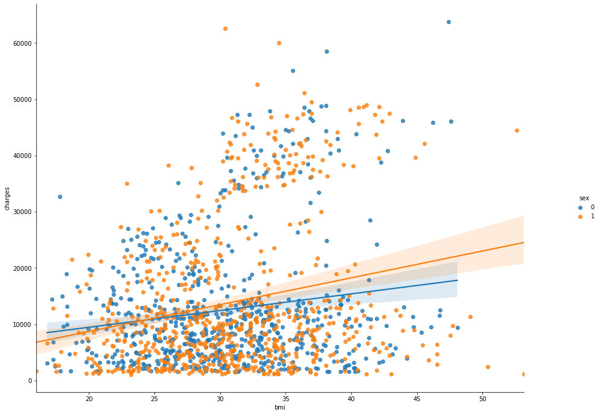
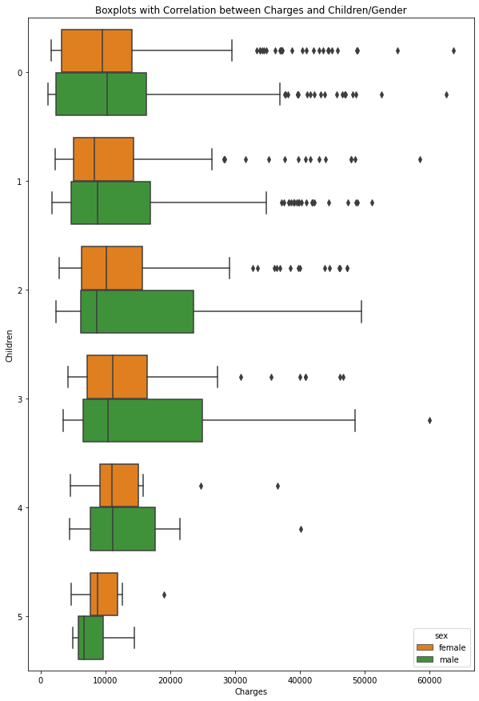
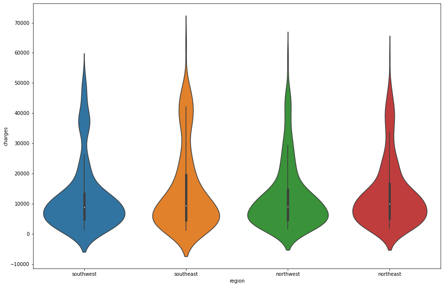
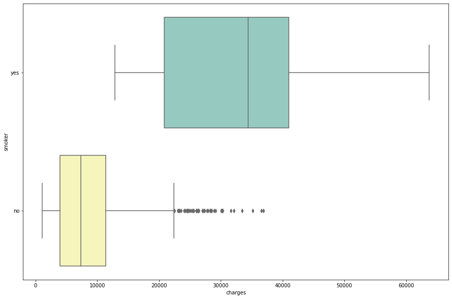

# Medical Cost Linear Regression Project Overview:
* Created a linear regression model that estimated the data with an r2 score of 0.8775 and a mean absolute error of 2778. 
* Downloaded the data from Kaggle: https://www.kaggle.com/mirichoi0218/insurance
* Did feature engenieering to turn categorical features into numerical ones, so they could be used in the linear regression algorithm 
* Turned my features into polynomial features for more accuracy

## Code
* Used Google Colab - Python 3.6.9
* Packages: numpy, pandas, sklearn, seaborn

## Data Exploration
* Checked data types 
* Checked for null values
* Looked at the 5 point summary of the data
* Looked at the unique value counts for each categorical feature

## Data Visualization

## Data Prep
* Changed the smoker and sex features to integer columns instead of categorical 
* Made dummy variables with pandas for the region column
* Checked the correlation again and decided to omit the region and children feature for the final algorithm
* Changed the remaining features into polynomical features to degree=2
* Split data into train and test set

## Regression Model Evaluation
Fit the training data to a linear regression model and got the following results:

* R2 Score: 0.8775 
* Mean Absolute Error: 2778.88
* Mean Squared Error: 19483634.37

